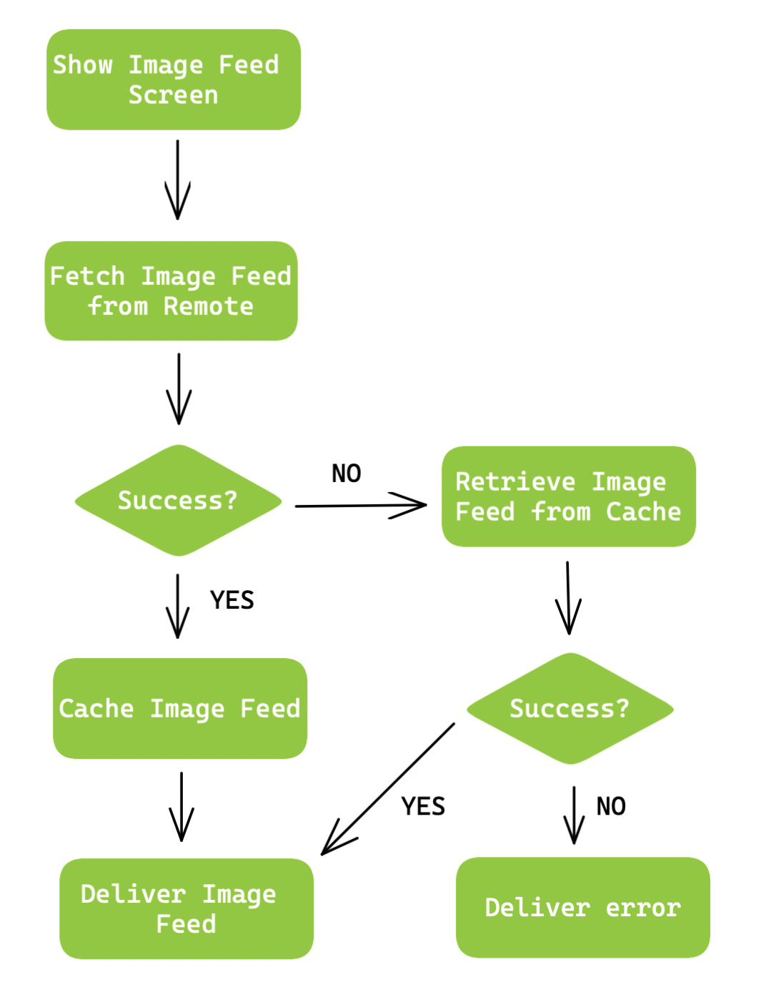

# essential-feed
Essential Feed case study

[](https://github.com/codeMnky01/essential-feed/actions/workflows/CI.yml)

## Story: Customer requests to see their image feed

### Narative #1

```
As online customer 
I want app to automaticaly load my latest image feed
So i can always enjoy newest images of friends
```

#### Scenarios (Acceptance criteria)

```
 Given the customer have connectivity
  When the customer requests to see their image feed
  Then the app should display latest image feed from remote
   And replace cache with new image feed
```

### Narative #2

```
As offline customer 
I want app to automaticaly load cached image feed
So i can always enjoy cached images while offline
```

#### Scenarios (Acceptance criteria)

```
 Given the customer doesn't have connectivity
   And there is a cached version of the image feed 
   And the cache is less then 7 days old
  When the customer request to show the image feed
  Then the app displays cache image feed

 Given the customer doesn't have connectivity
   And there is a cached version of the image feed 
   And the cache is 7 days old or more
  When the customer request to show the image feed
  Then the app displays error message
  
 Given the customer doesn't have connectivity
   And the cache is empty
  When the customer request to show the image feed
  Then the app displays error message
```


# Use Cases


## Load Feed from Remote - Use Case

#### Data: 
- URL

##### Primary course (happy path):
1. Execute "Load Image Feed" command with above data
2. System downloads data from URL
3. System validates downloaded data
4. System creates image feed from valid data
5. System delivers image feed

##### Invalid data - error course (sad path):
1. System delivers invalid data error

##### No connection - error course (sad path):
1. System delivers connectivity error

## Load Feed from Cache - Use Case

#### Data: 
- URL

##### Primary course (happy path):
1. Execute "Load Image Feed" command with above data
2. System retrieves image feed data from cache
3. System validates cache is less then 7 days old
4. System creates image feed from valid data
5. System delivers image feed

##### Retrieval error course (sad path):
1. System delivers retrieval error

##### Expired cache course (sad path):
1. System deletes cache
2. System delivers no feed images

##### Empty cache course (sad path):
1. System delivers no feed images

## Cache Feed - Use Case

#### Data:
- Image Feed

##### Primary course (happy path):
1. Execute "Save Image Feed" command with above data
2. System deletes old cache
3. System encodes new image feed
4. System timestamps encoded image feed
5. System saves new cached data
6. System delivers susccess message

##### Deleting error course (sad path):
1. System delivers error

##### Saving error course (sad path):
1. System deletes cache 

## Flowchart


## Model Specs

### Feed Image
| Property | Type |
| --- | --- |
| `id` | `UUID` |
| `description` | `String` (optional) |
| `location` | `String` (optional) |
| `url` | `URL` |

### Payload Contract
```
GET /feed

200 RESPONSE

{
	"items": [
		{
			"id": "a UUID",
			"description": "a description",
			"location": "a location",
			"image": "https://a-image.url",
		},
		{
			"id": "another UUID",
			"description": "another description",
			"image": "https://another-image.url"
		},
		{
			"id": "even another UUID",
			"location": "even another location",
			"image": "https://even-another-image.url"
		},
		{
			"id": "yet another UUID",
			"image": "https://yet-another-image.url"
		}
		...
	]
}
```


